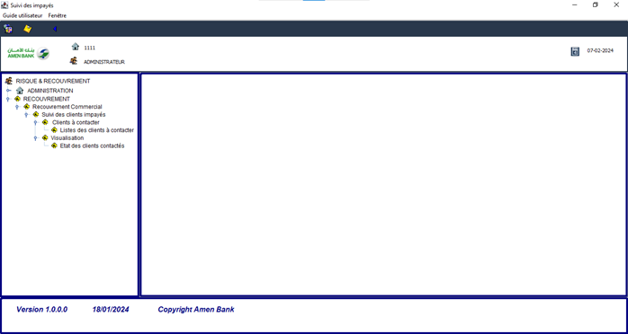

# Suivi-des-impayés

💼 **Project Overview**: *Suivi-des-impayés* is a desktop application designed to efficiently track client debts and unpaid invoices for banking institutions. Developed in Java with a clean and intuitive GUI, this application helps bank employees manage and monitor overdue payments effortlessly.

If you find this repository useful, please feel free to fork it and give it a star ⭐.

<div align="center">
  
  
  
  
  <a>
    
  </a>
</div>

## Table of Contents
- [🚀 Demo](#demo)
- [🖼️ Screenshots](#screenshots)
- [💻 Technologies](#technologies)
- [⚙️ Installation](#installation)
- [🐞 Bugs and Future Fixes](#bugs-and-future-fixes)
- [📜 License](#license)

## Screenshots



## Features

✨ **Key Features**:
- User-friendly interface to track and manage client debts
- Real-time updates for overdue payments and paid amounts
- Detailed reports and history of payments for each client
- Filtering options for sorting debts by client, date, or amount
- Dark/light theme toggle for optimal user experience

## Technologies

🛠️ **Built With**:
- **Java**
- **Swing** for GUI
- **SQLite** for database management

## Installation

1. **📥 Clone the repository**:
   ```bash
   git clone https://github.com/shadowxdgamer/Suivi-des-impayes.git
   cd Suivi-des-impayes

## 📄 License

This project is licensed under the MIT License. 